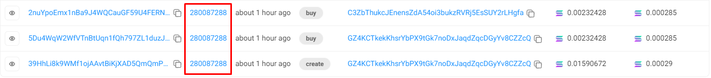

# Pumpfun Bundler README

## Overview

This is the best, fastest, and most efficient self-bundling script for PumpFun, allowing you to create a token and buy tokens with your own 2 buyers in one single bundle.

## Installation

`
npm i pumpdotfun-sdk
`

## Usage Example

First you need to create a `.env` file and set your RPC URL like in the `.env.example`

Then you need to fund an account with atleast 0.004 SOL that is generated when running the command below
To launch your token on Pumpfun site, edit the metadata as desired.
```typescript
    const metadata = {
      "name": "B@mbi",
      "symbol": "Bam",
      "description": "Bambi token",
      "image": "./upload/img.jpg",
      "showName": true,
      "createdOn": "https://pump.fun",
      "twitter": "https://x.com/bambi",
      "telegram": "https://t.me/bambi",
      "website": "https://bambi"
}
```
`
npx ts-node example/basic/index.ts
`
You can check token launch and bundling in this link:
  - pumpfun site
    https://pump.fun/2q4JLenwD1cRhzSLu3uPMQPw4fTEYp7bLtfmBwFLb48v
  - solscan.io
    

### PumpDotFunSDK Class

The `PumpDotFunSDK` class provides methods to interact with the PumpFun protocol. Below are the method signatures and their descriptions.


#### createAndBuy

```typescript
async createAndBuy(
  creator: Keypair,
  mint: Keypair,
  createTokenMetadata: CreateTokenMetadata,
  buyAmountSol: bigint,
  slippageBasisPoints: bigint = 500n,
  priorityFees?: PriorityFee,
  commitment: Commitment = DEFAULT_COMMITMENT,
  finality: Finality = DEFAULT_FINALITY
): Promise<TransactionResult>
```

- Creates a new token and buys it.
- **Parameters**:
  - `creator`: The keypair of the token creator.
  - `mint`: The keypair of the mint account.
  - `createTokenMetadata`: Metadata for the token.
  - `buyAmountSol`: Amount of SOL to buy.
  - `slippageBasisPoints`: Slippage in basis points (default: 500).
  - `priorityFees`: Priority fees (optional).
  - `commitment`: Commitment level (default: DEFAULT_COMMITMENT).
  - `finality`: Finality level (default: DEFAULT_FINALITY).
- **Returns**: A promise that resolves to a `TransactionResult`.

### Running the Examples

#### Basic Example

To run the basic example for creating, buying, and selling tokens, use the following command:

```bash
npx ts-node example/basic/index.ts
```

## Contributing

We welcome contributions! Please submit a pull request or open an issue to discuss any changes.

## License

This project is licensed under the MIT License - see the [LICENSE](LICENSE) file for details.

---

I made pumpfun bundler v2 
Create and buy with 20 wallets in a single bundle
